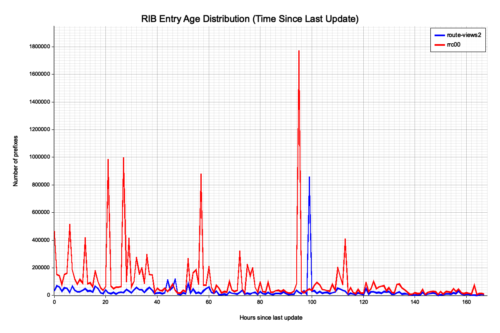
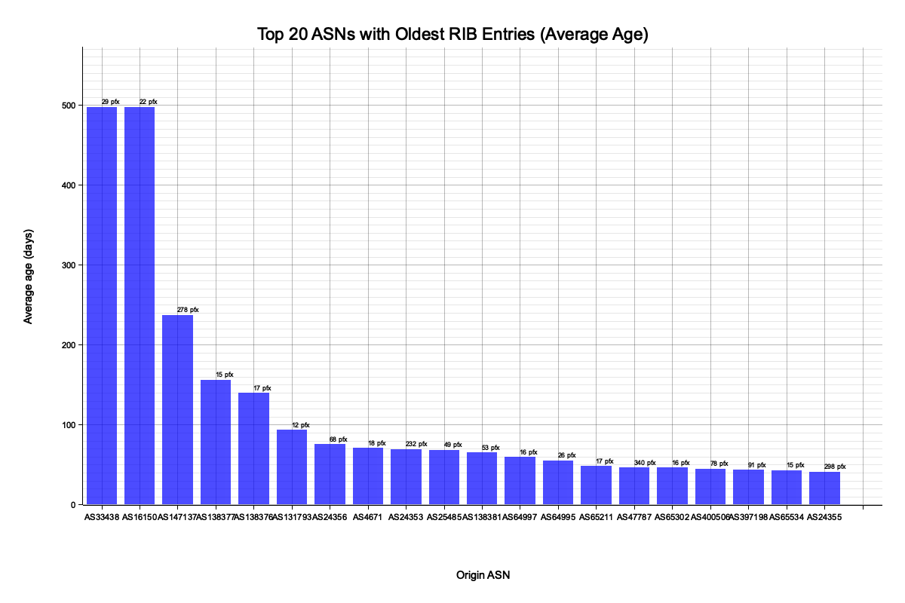

# RIB Dump Entries Age Analysis

This study analyzes the time difference between the RIB (Routing Information Base) dump timestamp (as indicated by the filename) and the actual update timestamp stored in each RIB entry. This reveals how "stale" the routing information is at the time of the dump.

## Background

When BGP collectors create RIB dumps, they capture a snapshot of the routing table at a specific moment. However, each entry in the RIB has its own timestamp indicating when that route was last updated. The difference between these timestamps shows how long ago each route was learned or modified.

Understanding this time difference is important for:
- Assessing routing stability (routes that haven't changed in a long time are stable)
- Identifying potential routing anomalies
- Understanding collector behavior differences between RouteViews and RIPE RIS

## Study Parameters

- **Target Date**: 2025-01-01T00:00:00Z (Unix timestamp: 1735689600)
- **Collectors**:
  - **route-views2**: RouteViews collector at University of Oregon
    - URL: `http://archive.routeviews.org/bgpdata/2025.01/RIBS/rib.20250101.0000.bz2`
  - **rrc00**: RIPE RIS collector in Amsterdam
    - URL: `https://data.ris.ripe.net/rrc00/2025.01/bview.20250101.0000.gz`

## Results Summary

### Overall Statistics

| Metric | route-views2 | rrc00 |
|--------|--------------|-------|
| Total Entries | 21,324,697 | 53,258,141 |
| Average Age | 7.15 days (171.55 hours) | 18.97 days (455.16 hours) |
| Median Age | 8.42 days (202.01 hours) | 12.87 days (308.96 hours) |
| Min Age | ~0 days | ~0 days |
| Max Age | 8.42 days (202.06 hours) | 497.61 days (11,942.56 hours) |

**Key Observations:**
- **route-views2** shows a very tight distribution with entries clustering around 8 days old, indicating the collector likely performs periodic RIB rebuilds approximately every 8 days.
- **rrc00** has a much wider distribution with some entries dating back nearly 500 days, suggesting RIPE RIS preserves original route timestamps longer.
- The total dataset contains **74.6 million** RIB entries across both collectors.

### Time Difference Distribution



This chart shows the distribution of entry ages in hours (up to 168 hours / 7 days). Each line represents a different collector:
- **Blue**: route-views2 (RouteViews)
- **Red**: rrc00 (RIPE RIS)

The route-views2 distribution shows a sharp spike near the maximum age (~200 hours), while rrc00 shows a more gradual distribution with peaks in the early hours and a long tail extending well beyond the 7-day window shown.

### Top 20 ASNs with Oldest Entries



This bar chart shows the top 20 ASNs with the highest average entry age (in days). Notable findings:

| Rank | ASN | Avg Age (days) | Prefix Count |
|------|-----|----------------|--------------|
| 1 | AS33438 | 497.61 | 29 |
| 2 | AS16150 | 497.61 | 22 |
| 3 | AS147137 | 237.33 | 278 |
| 4 | AS138377 | 155.97 | 15 |
| 5 | AS138376 | 139.58 | 17 |

The oldest entries (AS33438 and AS16150) have routes that haven't been updated in over 497 days (~1.4 years), indicating extremely stable routing configurations for these networks.

## Project Structure

This is a two-phase project:

```
rib_time_diff_study/
├── Cargo.toml
├── README.md
├── src/
│   └── bin/
│       ├── phase1_collect.rs    # Data collection and CSV generation
│       └── phase2_visualize.rs  # Visualization and chart generation
└── output/
    ├── rib_time_diff.csv        # Raw data output
    ├── summary.txt              # Statistics summary
    ├── time_diff_distribution.png
    └── top_asn_time_diff.png
```

## Running the Study

### Phase 1: Data Collection

```bash
cd examples/rib_time_diff_study
cargo run --release --bin phase1_collect
```

This phase:
1. Downloads RIB dumps from route-views2 and rrc00
2. Parses each BGP element (per-prefix entry)
3. Calculates the time difference: `dump_timestamp - entry_timestamp`
4. Outputs a CSV file with columns: `collector`, `prefix`, `origin_asn`, `time_diff_secs`

**Note**: This phase downloads large files (~100-200MB each) and may take several minutes.

### Phase 2: Visualization

```bash
cargo run --release --bin phase2_visualize
```

This phase:
1. Reads the CSV data from Phase 1
2. Generates two visualization charts and a summary file:
   - **Distribution plot**: Shows how entry ages are distributed
   - **Top ASN plot**: Shows which ASNs have the oldest entries on average
   - **Summary file**: Contains detailed statistics

## Output Files

### CSV Data (`output/rib_time_diff.csv`)

| Column | Description |
|--------|-------------|
| `collector` | Collector name (route-views2 or rrc00) |
| `prefix` | Network prefix (e.g., "192.0.2.0/24") |
| `origin_asn` | Origin AS number for the prefix |
| `time_diff_secs` | Seconds between dump time and entry update time |

## Interpretation

- **Low time_diff_secs**: The route was recently updated, indicating either routing changes or periodic re-announcements
- **High time_diff_secs**: The route has been stable for a long time without any updates

Key findings from this study:
- RouteViews (route-views2) appears to rebuild its RIB periodically (~8 days), resulting in a narrow age distribution
- RIPE RIS (rrc00) preserves original timestamps, showing the true age of routes which can span over a year
- Most routes are relatively stable, with median ages of 8-13 days
- A small number of ASNs have extremely old entries (400+ days), representing very stable network configurations

## Dependencies

- `bgpkit-parser`: MRT/BGP data parsing
- `csv`: CSV file I/O
- `serde`: Serialization/deserialization
- `plotters`: Chart generation
- `indicatif`: Progress indicators

## License

This example is part of bgpkit-parser and is licensed under the MIT License.
