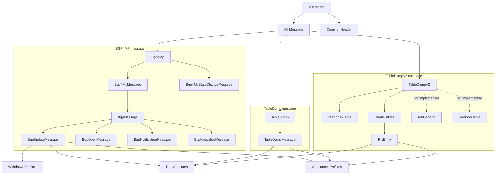
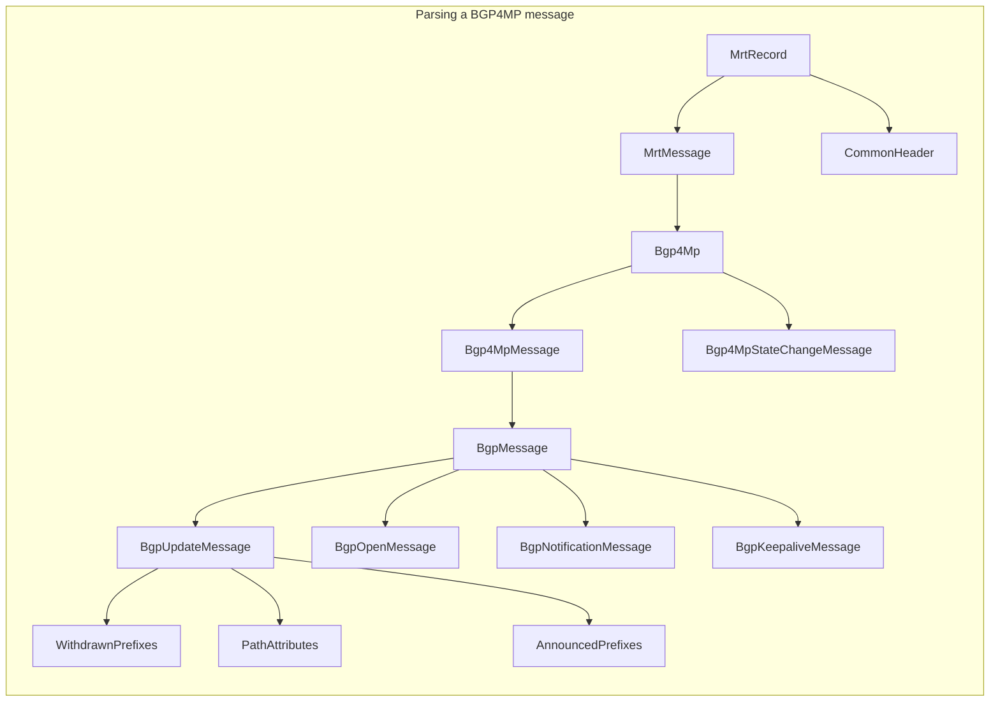
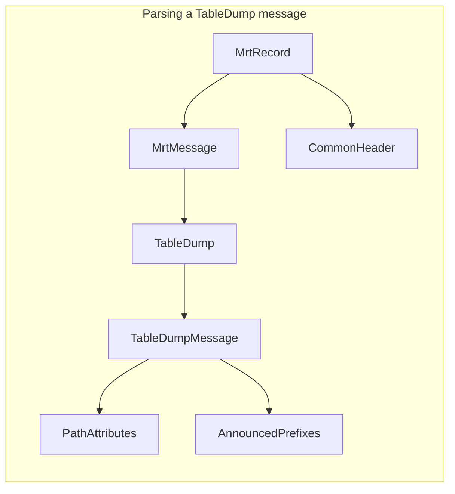
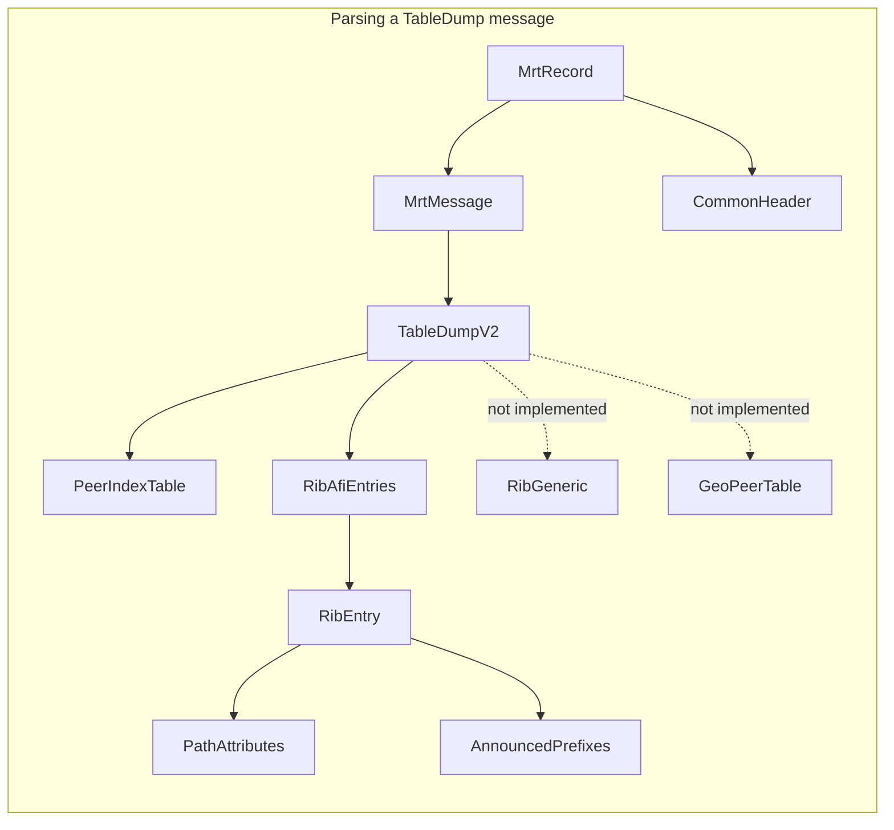

# Parser module

## Code flows

### Overview

```mermaid
flowchart TB

    MrtRecord --> MrtMessage & CommonHeader
    MrtMessage --> Bgp4Mp & TableDump & TableDumpV2

    subgraph "BGP4MP message"
        Bgp4Mp --> Bgp4MpMessage & Bgp4MpStateChangeMessage
        Bgp4MpMessage --> BgpMessage
        BgpMessage --> BgpUpdateMessage & BgpOpenMessage & BgpNotificationMessage & BgpKeepaliveMessage
    end
    BgpUpdateMessage --> WithdrawnPrefixes & PathAttributes & AnnouncedPrefixes

    subgraph "TableDump message"
        TableDump --> TableDumpMessage
    end
    TableDumpMessage --> PathAttributes & AnnouncedPrefixes

    subgraph "TableDumpV2 message"
        TableDumpV2 --> PeerIndexTable & RibAfiEntries
        TableDumpV2 -.not implemented.-> RibGeneric & GeoPeerTable
        RibAfiEntries --> RibEntry
    end
    RibEntry --> PathAttributes & AnnouncedPrefixes
```

### Code flow for a BGP4MP message

```mermaid
flowchart LR
    subgraph "Parsing a BGP4MP message" 
    MrtRecord --> MrtMessage & CommonHeader
    
    %% MRT message types
    MrtMessage --> Bgp4Mp
    
    %% BGP4MP message types
    Bgp4Mp --> Bgp4MpMessage & Bgp4MpStateChangeMessage
    
    Bgp4MpMessage --> BgpMessage
    BgpMessage --> BgpUpdateMessage & BgpOpenMessage & BgpNotificationMessage & BgpKeepaliveMessage
    
    BgpUpdateMessage --> WithdrawnPrefixes & PathAttributes & AnnouncedPrefixes
    end
```

### Code flow for a TableDump (deprecated) message

```mermaid
flowchart LR
    subgraph "Parsing a TableDump message"
        MrtRecord --> MrtMessage & CommonHeader
        MrtMessage --> TableDump 
        TableDump --> TableDumpMessage
        TableDumpMessage --> PathAttributes & AnnouncedPrefixes
    end
```
### Code flow for a TableDumpV2  message

```mermaid
flowchart LR
    subgraph "Parsing a TableDump message"
        MrtRecord --> MrtMessage & CommonHeader
        MrtMessage --> TableDumpV2
        TableDumpV2 --> PeerIndexTable & RibAfiEntries 
        TableDumpV2 -.not implemented.-> RibGeneric & GeoPeerTable
        RibAfiEntries --> RibEntry
        RibEntry --> PathAttributes & AnnouncedPrefixes
    end
```

